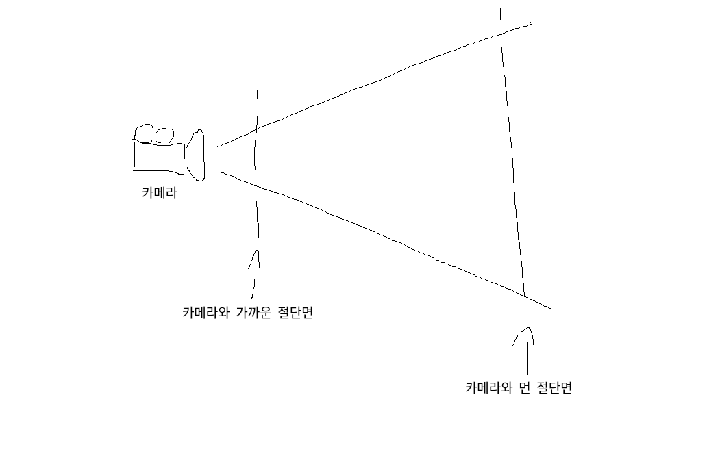

# 씬 제작하기
이 섹션의 목표는 three.js의 간략한 소개를 하는 것입니다.<br>
돌아가는 큐브와 함께 씬을 만들면서 시작을 해볼 것입니다.<br>
도음이 필요하거나 하다가 막혔을 경우를 대비해 아래에 예제를 올려놓았습니다.<br><br>
## 시작하기 전에
___
Three.js를 사용하기 전에, 이것을 보여줄 무언가가 필요합니다.<br>
다음 HTML코드를 컴퓨터에 파일을 만들어 저장하고, js 디렉토리 내에 three.js 사본과 함께 브라우저로 엽니다.
```html
<!DOCTYPE html>
<html>
	<head>
		<meta charset="utf-8">
		<title>My first three.js app</title>
		<style>
			body { margin: 0; }
		</style>
	</head>
	<body>
		<script src="js/three.js"></script>
		<script>
			// Our Javascript will go here.
		</script>
	</body>
</html>
```
이게 답니다.<br>
아래에 모든 코드는 빈 `<script>`태그 안에 들어갑니다.<br><br>
## 씬 만들기
실제로 Three.js로 무언가를 표시하려면,<br>
카메라로 씬을 렌더링할 수 있게
씬, 카메라, 렌더러, 이 세가지가 필요합니다.
```js
const scene = new THREE.Scene();
const camera = new THREE.PerspectiveCamera( 75, window.innerWidth / window.innerHeight, 0.1, 1000 );

const renderer = new THREE.WebGLRenderer();
renderer.setSize( window.innerWidth, window.innerHeight );
document.body.appendChild( renderer.domElement );
```
이 코드에서 무슨 일이 일어나고 있는지 잠시 설명하겠습니다.<br>
방금 씬과 카메라, 렌더러를 만들었습니다.<br><br>
Three.js에는 몇 개의 다른 카메라가 있는데, 지금은 PerspectiveCamera를 사용했습니다.<br><br>
PerspectiveCamera의 첫번째 인자로는 **시야각**이 들어갑니다.<br>
시야각은 주어진 순간에 보이는 장면의 범위를 나타냅니다.<br>
값으로 각도가 들어갑니다.<br><br>
PerspectiveCamera의 두번째 인자로는 **화면비**가 들어갑니다.<br>
코드에 나와 있듯 화면비는 거의 항상 요소의 너비를 높이로 나눈 값이 대중적으로 사용됩니다.<br>
<span style="font-size: 14px; color: #d3d3d3;">예) 16:9비율은 16/9</span>
<br><br>
다음 두 개의 인자는 각각 **가깝고 먼 두 절단면의 거리**를 나타냅니다.<br>
즉, 오브젝트를 보기 위해선 오브젝트는 카메라와 가까운 절단면과 카메라와 먼 절단면 사이에 있어야 합니다.

지금은 잘 모르겠다고 걱정할 필요는 없지만, 더 나은 성능을 얻기 위해 다른 값을 사용할 수 있습니다.<br><br>
다음은 렌더러입니다.<br>
three.js는 우리가 여기에서 사용했던 **WebGLRender** 외에도 몇가지 다른 렌더러들도 지원하며,
어떤 이유로 WebGL를 지원하지 못하거나 오래된 브라우저를 사용하는 유저를 위해 다른 렌더러로 대체하는데 많이 사용됩니다.<br><br>
렌더러 인스턴스를 만드는 것 외에도 웹이나 앱에 렌더링할 사이즈, 크기를 설정해줘야한다.<br>
이때 setSize라는 메서드를 이용하며 채우고자 하는 영역의 너비와 높이값을 쓰는게 좋습니다.<br> 여기선 브라우저 윈도우의 너비와 높이값을 사용했습니다.<br>
앱의 성능 향상을 위해 setSize에 더 작은 값을 줄 수가 있는데, 예를 들어 window.innerWidth/2 값을 너비로, window.innerHeight/2 값을 높이로 주면 렌더링되는 사이즈를 1/4로 만들 수 있습니다.<br><br>
만약 앱의 사이즈를 유지하면서 해상도를 줄이고 싶다면, setSize의 **세번째 인자**인 updateStyle을 **false**로 만들어주면 됩니다.<br>
예) `renderer.setSize(window.innerWidth, window.innerHeight, false)`<br>
